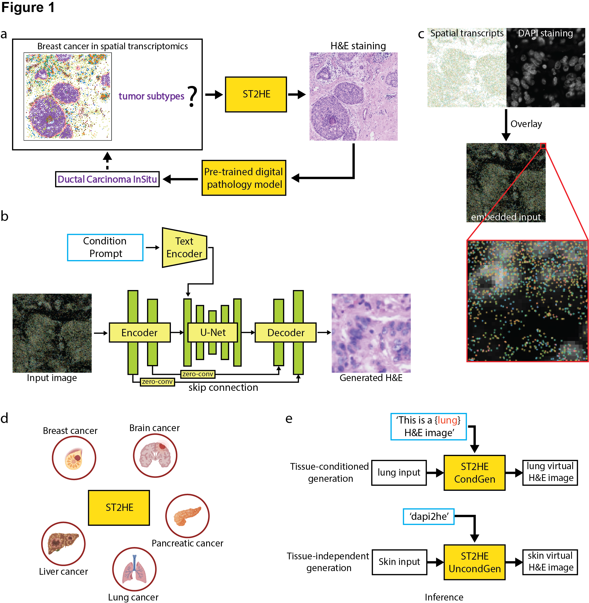

# ST2HE: Virtual Histology from High-Resolution Spatial Transcriptomics

**ST2HE** is a cross-platform, generative framework that synthesizes **virtual Hematoxylin & Eosin (H&E)** histology images directly from **high-resolution spatial transcriptomics (HR-ST)** data.  
By integrating DAPI morphology and spatial transcript coordinates using a **one-step diffusion model**, ST2HE bridges the gap between molecular and histological domains—enabling interpretable, scalable annotation of HR-ST datasets.

---

## Key Features

- **Virtual H&E generation** directly from HR-ST data (e.g. Xenium, NanoString CosMx, MERFISH).  
- **One-step diffusion model** (Pix2Pix-Turbo backbone) for fast and high-fidelity image translation.  
- **Conditional & unconditional modes:**
  - `ST2HE-CondGen` — tissue-specific generation using CLIP text prompts.  
  - `ST2HE-UncondGen` — generalizable model for unseen tissues.  
- **Cross-platform generalization** demonstrated on:
  - Xenium Breast Cancer
  - NanoString NSCLC
  - Xenium Kaposi's Sarcoma
- **Multi-colored transcript visualization** to maximize morphology-gene expression coupling.
- Compatible with pathology foundation models (e.g., **CONCH**) for downstream classification and annotation.
- **Batch processing** and **sample generation** utilities for efficient workflow.

---

## Conceptual Overview

The ST2HE framework converts high-resolution spatial transcriptomics (HR-ST) data into virtual H&E images through a one-step diffusion model built on Pix2Pix-Turbo, integrating DAPI morphology and transcript spatial coordinates.

<p align="center">
  
</p>

**Figure 1. Overview of ST2HE Framework.**
- **(a)** ST2HE bridges transcriptomic data with histological features, enabling automated annotation of tumor subtypes.  
- **(b)** Architecture: Encoder–U-Net–Decoder backbone with CLIP-based text conditioning ("This is a {tissue} H&E image" or "dapi2he").  
- **(c)** Input preparation: DAPI + transcript overlay → embedded input.  
- **(d–e)** Dual modes:  
  - **ST2HE-CondGen:** tissue-conditioned generation (e.g., lung input → lung virtual H&E).  
  - **ST2HE-UncondGen:** tissue-independent generalization for unseen tissues (e.g., skin input → skin virtual H&E).

---

## Installation

### Prerequisites

- Python 3.8+
- CUDA-capable GPU (recommended)
- CUDA ≥ 11.8 and PyTorch ≥ 2.1 (for GPU acceleration)

### Setup

1. Clone the repository:
```bash
git clone https://github.com/Huang-AI4Medicine-Lab/ST2HE.git
cd ST2HE
```

2. Create environment:
```bash
conda env create -f environment.yml
conda activate st2he
```

*(or use pip with `requirements.txt`)*

3. Ensure the pix2pix-turbo model is available. The code expects it at `/ix/yufeihuang/timothy/cycleGAN/img2img-turbo/` by default. Update `PIX2PIX_TURBO_PATH` in `src/inference.py` (line 16) if your model is located elsewhere.

---

## Quickstart: Generate Virtual H&E

### Single Image Inference

Convert a single spatial transcriptomics image to H&E:

```bash
python src/inference.py \
    --model_path /path/to/model/checkpoint.pkl \
    --input /path/to/input/image.png \
    --output /path/to/output/image.png \
    --prompt "image of HE" \
    --direction a2b
```

**Example: Xenium sample (Conditional Generation)**
```bash
python src/inference.py \
    --model_path /path/to/st2he_condgen_model.pkl \
    --input data/xenium/sample1_dapi.png \
    --output results/sample1_virtual_he.png \
    --prompt "This is a breast H&E image" \
    --direction a2b
```

**Example: Unseen tissue - Unconditional Generation**
```bash
python src/inference.py \
    --model_path /path/to/st2he_uncongen_model.pkl \
    --input data/ks/core_01_dapi.png \
    --output results/core_01_virtual_he.png \
    --prompt "dapi2he" \
    --direction a2b
```

### Batch Inference

Process a directory of images:

```bash
python src/inference.py \
    --model_path /path/to/model/checkpoint.pkl \
    --input /path/to/input/directory \
    --output /path/to/output/directory \
    --prompt "image of HE" \
    --direction a2b
```

Or use the provided bash script:
```bash
bash scripts/inference_batch.sh
```

Customize with environment variables:
```bash
export MODEL_PATH="/path/to/model/checkpoint.pkl"
export INPUT_DIR="/path/to/input/images"
export OUTPUT_DIR="/path/to/output/images"
export PROMPT="This is a breast H&E image"
bash scripts/inference_batch.sh
```

### Sample Generation

Generate multiple variations and comparison images:

```bash
python src/generate_samples.py \
    --model_path /path/to/model/checkpoint.pkl \
    --input /path/to/input/image1.png /path/to/input/image2.png \
    --output_dir /path/to/output/directory \
    --num_variations 3 \
    --prompt "image of HE"
```

Process all images in a directory:
```bash
python src/generate_samples.py \
    --model_path /path/to/model/checkpoint.pkl \
    --input /path/to/input/directory \
    --output_dir /path/to/output/directory \
    --num_variations 2
```

### Python API

Use the inference class directly in Python:

```python
from src.inference import ST2HEInference

# Initialize model
inference = ST2HEInference(
    model_path="/path/to/model/checkpoint.pkl",
    prompt="This is a breast H&E image",  # or "dapi2he" for unconditional
    direction="a2b",
    use_fp16=True  # Faster inference on compatible GPUs
)

# Convert single image
output_img = inference.predict("/path/to/input/image.png")
output_img.save("/path/to/output/image.png")

# Batch processing
inference.predict_batch(
    input_dir="/path/to/input/directory",
    output_dir="/path/to/output/directory"
)
```

---

## Configuration Options

### Model Parameters

- `--model_path`: Path to the trained pix2pix-turbo model checkpoint (.pkl file)
- `--prompt`: Text prompt for the model
  - Conditional mode: `"This is a {tissue} H&E image"` (e.g., "This is a breast H&E image")
  - Unconditional mode: `"dapi2he"` or `"image of HE"`
- `--direction`: Translation direction
  - `a2b`: Spatial transcriptomics → H&E (default)
  - `b2a`: H&E → Spatial transcriptomics
- `--image_prep`: Image preparation method
  - `no_resize`: Use original image size (default)
  - `resize_512x512`: Resize to 512x512
  - Other options available in pix2pix-turbo

### Performance Options

- `--use_fp16`: Use Float16 precision for faster inference (requires compatible GPU)

---

## Project Structure

```
ST2HE/
├── src/
│   ├── __init__.py              # Package initialization
│   ├── inference.py             # Main inference module (ST2HEInference class)
│   └── generate_samples.py      # Sample generation utilities
├── scripts/
│   ├── inference_batch.sh       # Batch processing script
│   └── setup_github.sh          # GitHub setup helper
├── examples/
│   └── example_usage.py         # Example Python scripts
├── tests/                       # Unit tests
├── configs/
│   └── default_config.yaml      # Configuration file template
├── figs/                        # Figure images
├── requirements.txt             # Python dependencies
├── .gitignore                  # Git ignore rules
└── README.md                   # This file
```

---

## Model Paths

By default, the code expects the pix2pix-turbo model at:
```
/ix/yufeihuang/timothy/cycleGAN/img2img-turbo/
```

Update the `PIX2PIX_TURBO_PATH` variable in `src/inference.py` (line 16) if your model is located elsewhere.

---

## Examples

### Example 1: Convert DPS image to H&E (Conditional Generation)

```bash
python src/inference.py \
    --model_path /ix/yufeihuang/timothy/cycleGAN/img2img-turbo/output/cyclegan_turbo/dps_col_bracs/checkpoints/model_25001.pkl \
    --input /path/to/dps_image.png \
    --output /path/to/he_output.png \
    --prompt "This is a breast H&E image" \
    --direction a2b \
    --image_prep no_resize
```

### Example 2: Batch processing with comparisons

```bash
python src/generate_samples.py \
    --model_path /path/to/model.pkl \
    --input /path/to/dps_images/ \
    --output_dir /path/to/he_outputs/ \
    --num_variations 1 \
    --prompt "image of HE"
```

---

## Notes

- The model requires CUDA for optimal performance
- Processing time depends on image size and hardware
- Generated images maintain the original input image dimensions
- Batch processing automatically creates output directories if they don't exist
- For tissue-specific generation, use conditional prompts (e.g., "This is a {tissue} H&E image")
- For generalization to unseen tissues, use unconditional prompts (e.g., "dapi2he")

---

## Citation

If you use this repository, please cite:

```bibtex
@article{liu2025st2he,
  title={ST2HE: A Cross-Platform Framework for Virtual Histology and Annotation of High-Resolution Spatial Transcriptomics Data},
  author={Liu, Zhentao and Das, Arun and Meng, Wen and Chiu, Yu-Chiao and Gao, Shou-Jiang and Huang, Yufei},
  year={2025},
  journal={Preprint},
  note={University of Pittsburgh & UPMC Hillman Cancer Center}
}
```

If you use the Pix2Pix-Turbo backbone, please also cite:

```bibtex
@article{parmar2024onestep,
  title={One-Step Image Translation with Text-to-Image Models},
  author={Parmar, Gaurav and Park, Taesung and Narasimhan, Srinivasa and Zhu, Jun-Yan},
  journal={arXiv preprint arXiv:2403.12036},
  year={2024}
}
```

---

## Acknowledgements

Supported by NIH (U01CA279618, R21GM155774, CA096512, CA284554, CA278812, CA291244, CA124332, R35GM154967) and UPMC Hillman Cancer Center Startup Funds.  
Computing resources provided by **University of Pittsburgh Center for Research Computing (HTC Cluster, S10OD028483)**.

---

**Maintainer:** Huang AI4Medicine Lab  
University of Pittsburgh | UPMC Hillman Cancer Center  
yuh119@pitt.edu
